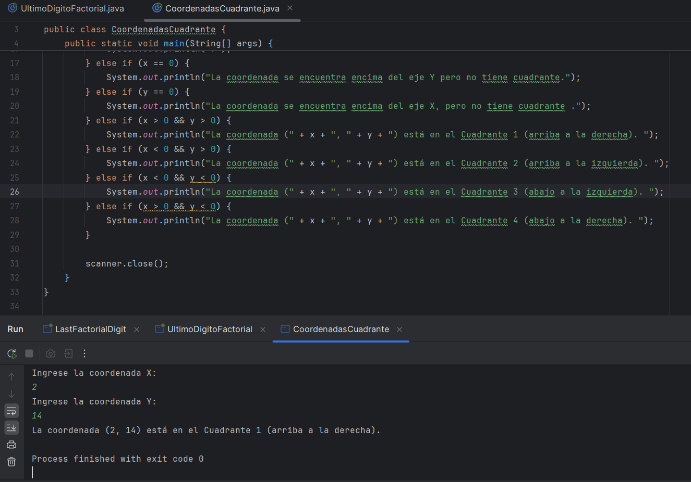

Descripción de los Códigos

1. Identificador de Cuadrantes

### Propósito

Este programa identifica en cuál de los cuatro cuadrantes de un plano cartesiano se encuentra un par de coordenadas (“x”, “y”) ingresadas por el usuario a través de la consola. Además, considera casos especiales cuando las coordenadas están en los ejes o en el origen.

··· Lógica

Entrada: Coordenadas (“x”, “y”) proporcionadas por el usuario.

Salida:

El cuadrante donde se encuentra la coordenada.

Mensajes especiales si las coordenadas están en los ejes o en el origen.

Comportamiento del Programa

Si x = 0 y y = 0, se imprime ? (indica que está en el origen).

Si x = 0, se indica que la coordenada está en el eje Y.

Si y = 0, se indica que la coordenada está en el eje X.

Para el resto de los casos:

Cuadrante 1: La coordenada (x, y) esta en el Cuadrante 1 (arriba a la derecha). 

Cuadrante 2: La coordenada (x, y) esta en el Cuadrante 2 (arriba a la izquierda). 

Cuadrante 3: La coordenada (x,y) esta en el Cuadrante 3 (abajo a la izquierda).

Cuadrante 4: La coordenada (x,y) esta en el Cuadrante 4 (abajo a la derecha).

Ejemplo de Uso

Entrada:

Ingrese la coordenada X:
2
Ingrese la coordenada Y:
14
### Foto1

Salida:

La coordenada (2, 14) está en el Cuadrante 1 (arriba a la derecha).

Código

import java.util.Scanner;

public class CoordenadasCuadrante {
    public static void main(String[] args) {
        Scanner scanner = new Scanner(System.in);

        // Solicitar coordenadas al usuario
        System.out.println("Ingrese la coordenada X:");
        int x = scanner.nextInt();

        System.out.println("Ingrese la coordenada Y:");
        int y = scanner.nextInt();

        // Determinar en qué cuadrante se encuentra o si es un caso especial
        if (x == 0 && y == 0) {
            System.out.println("?");
        } else if (x == 0) {
            System.out.println("La coordenada esta en el eje Y.");
        } else if (y == 0) {
            System.out.println("La coordenada esta en el eje X.");
        } else if (x > 0 && y > 0) {
            System.out.println("La coordenada (" + x + ", " + y + ") esta en el Cuadrante 1 (arriba a la derecha). ");
        } else if (x < 0 && y > 0) {
            System.out.println("La coordenada (" + x + ", " + y + ") esta en el Cuadrante 2 (arriba a la izquierda). ");
        } else if (x < 0 && y < 0) {
            System.out.println("La coordenada (" + x + ", " + y + ") esta en el Cuadrante 3 (abajo a la izquierda). ");
        } else if (x > 0 && y < 0) {
            System.out.println("La coordenada (" + x + ", " + y + ") esta en el Cuadrante 4 (abajo a la derecha). ");
        }

        scanner.close();
    }
}

2. Último Dígito del Factorial

### Propósito

El objetivo de este programa es calcular el último dígito del factorial de un número dado. Dado que los factoriales pueden ser extremadamente grandes, el programa se enfoca en determinar únicamente el último dígito, lo cual es computacionalmente más eficiente.

··· Lógica

Entrada:

Un número entero positivo  (1 <  < 10) que indica el número de casos de prueba.

 líneas siguientes, cada una con un entero positivo .

Salida: El último dígito de  para cada caso de prueba.

Observaciones

Si , el último dígito siempre es 0 (por la multiplicación por 10 en el factorial).

Para , el cálculo del factorial es sencillo y basta con usar  para obtener el último dígito.

Ejemplo de Uso

Entrada:

3
1
2
3

Salida:

1
2
6
### Foto2
Código

import java.util.Scanner;

public class UltimoDigitoFactorial {
    public static void main(String[] args) {
        Scanner scanner = new Scanner(System.in);

        System.out.println("Ingrese el número de casos de prueba (T):");
        int T = scanner.nextInt();

        for (int i = 0; i < T; i++) {
            System.out.println("Ingrese un número N:");
            int N = scanner.nextInt();
            System.out.println(calcularUltimoDigitoFactorial(N));
        }

        scanner.close();
    }

    public static int calcularUltimoDigitoFactorial(int N) {
        if (N >= 5) {
            return 0; // Si N >= 5, el último dígito siempre es 0.
        }

        int factorial = 1;
        for (int i = 1; i <= N; i++) {
            factorial *= i;
        }

        return factorial % 10; // Obtener el último dígito
    }
}

Resumen de Conceptos

Identificador de Cuadrantes

Uso de condiciones para evaluar rangos («if» y «else if»).

Manejo de coordenadas y su clasificación en cuadrantes.

Último Dígito del Factorial

Factorial: Producto de los números enteros positivos hasta un valor .

Operador módulo («%»): Obtención del residuo para determinar el último dígito.

Optimización para casos grandes ().